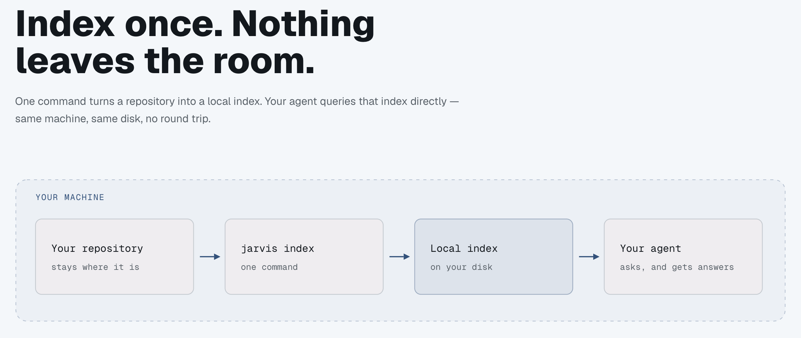

# jarvis

[](https://jarvis-intelligence.github.io/jarvis-index/)

**Local-first code intelligence for coding agents.** Index your own repositories with SCIP and
Zoekt, then let the agent ask structural questions — *who calls this?*, *where is this defined?* —
instead of guessing from grep.

[](https://pypi.org/project/jarvis-mcp/)
[](plugin/LICENSE)


Everything runs on your machine. No code leaves it, no telemetry, no account.

This repo is the **public distribution surface**: the installer, the plugins, the binary release
assets, and the issue tracker. It holds no source — see [Why this repo exists](#why-this-repo-exists).

---

## What you get

Nine MCP tools, exposed to any MCP client:

| | Tool | Answers |
|---|---|---|
| **Navigate** | `goToDefinition` | Where is `X` defined? |
| | `findReferences` | Everywhere `X` is used |
| | `callHierarchy` | What calls `X`, and what `X` calls |
| | `typeHierarchy` | Super/subtypes of `X` |
| | `documentSymbols` | Every symbol in a file |
| **Search** | `searchCode` | Lexical search across indexed repos (Zoekt) |
| | `semanticSearch` | Natural-language search — needs the `[semantic]` extra |
| **Scope** | `blastRadius` | Which other indexed repos depend on this package |
| | `getIndexStatus` | Is this repo indexed, and is the index stale? |

Plus three agent skills that ship with the plugin: **`jarvis-setup`** (onboarding),
**`jarvis-use`** (steers the agent toward structural queries over grep), and **`jarvis-issues`**
(files well-formed bug reports).

Full signatures and return shapes: [`plugin/skills/jarvis-use/references/tool-roster.md`](plugin/skills/jarvis-use/references/tool-roster.md).

## Quick start

```bash
# 1. External binaries (scip, zoekt, language indexers) → ~/.jarvis/bin
curl -fsSL https://raw.githubusercontent.com/jarvis-intelligence/jarvis-index/main/setup.sh | sh

# 2. The CLI + MCP server
uv tool install jarvis-mcp

# 3. Index a repo (slug defaults to the directory name)
jarvis index /path/to/your/repo

# 4. Verify
jarvis status <slug>          # expect: indexed
```

Then register the MCP server — or skip that entirely by installing the plugin below, which
registers it for you.

`setup.sh` is idempotent; re-running skips what is already present. Options: `--only <name>`,
`--force`, `--help`.

## Install as a plugin

The plugin bundles the MCP registration and all three skills, so there is no manual `mcp add`.

| Client | How |
|---|---|
| **Claude Code** | `/plugin marketplace add jarvis-intelligence/jarvis-index`<br>`/plugin install jarvis@jarvis` |
| **Codex CLI** | `codex plugin marketplace add https://github.com/jarvis-intelligence/jarvis-index --ref main`<br>`codex plugin add jarvis` |
| **Cursor** | Dashboard → Plugins → Add Marketplace → Import from Repo *(Teams/Enterprise)*<br>or clone and `ln -s "$PWD/jarvis-index/plugin" ~/.cursor/plugins/local/jarvis` |
| **Other MCP clients** | Point them at the stdio command `jarvis-server` |

Still run `setup.sh` + `jarvis index` afterwards — the plugin ships the wiring, not the binaries.

Details, the optional `[semantic]` extra, and privacy notes: [`plugin/README.md`](plugin/README.md).

## Requirements

- **macOS or Linux.** Windows is not supported.
- [`uv`](https://docs.astral.sh/uv/) on `PATH`.
- `java` on `PATH` only if you index Java/Kotlin repos.

## Language support

One language per index — a polyglot repo indexes only its plurality language.

| Language | Indexer | Notes |
|---|---|---|
| TypeScript / JavaScript | `scip-typescript` | |
| Python | `scip-python` | |
| Swift | `scip-swift` | macOS arm64 only; pass `--scheme` if the Xcode project has several |
| Java / Kotlin | `scip-java` | Android/Gradle projects and repos off the pinned Kotlin version are published **search-only** — lexical and semantic search work, navigation does not |

## Why this repo exists

jarvis's development repo is private, and GitHub serves raw files and release assets **only to
viewers of the owning repo**. An unauthenticated `curl` against a private repo's `setup.sh` 404s —
which is every real user. So every user-facing install path lives here, in public:

- `setup.sh`, fetchable by anyone
- the Claude Code / Codex / Cursor plugins
- the `scip` and `zoekt` binaries, as GitHub release assets
- the issue tracker

The Python package itself is on PyPI as [`jarvis-mcp`](https://pypi.org/project/jarvis-mcp/).

## Repo layout

```
setup.sh              Dependency bootstrapper — SYNCED from the dev repo, do not edit here
plugin/               The plugin: skills, MCP config, assets — source of truth, edit directly
.claude-plugin/       Claude Code marketplace manifest
.codex-plugin/        Codex CLI plugin manifest
.cursor-plugin/       Cursor marketplace manifest
docs/                 Maintainer documentation for this repo
```

## Editing this repo

| Path | Rule |
|---|---|
| `setup.sh` | **Never edit here.** Published automatically from the development repo and overwritten on the next release. Fix it upstream. |
| everything else | Source of truth is **here** — edit directly. |

Any change under `plugin/` must bump the `version` in **all three** plugin manifests, to the same
value, or it reaches nobody: `plugin/.claude-plugin/plugin.json`,
`plugin/.cursor-plugin/plugin.json`, `.codex-plugin/plugin.json`. The plugin versions
independently of the `jarvis-mcp` package on PyPI.

Full conventions: [`docs/code-standards.md`](docs/code-standards.md).

## Docs

[overview](docs/project-overview-pdr.md) ·
[architecture](docs/system-architecture.md) ·
[codebase summary](docs/codebase-summary.md) ·
[standards](docs/code-standards.md) ·
[publishing](docs/deployment-guide.md) ·
[roadmap](docs/project-roadmap.md)

## Links

- **Issues / feature requests:** <https://github.com/jarvis-intelligence/jarvis-index/issues>
- **Changelog:** [PyPI release history](https://pypi.org/project/jarvis-mcp/#history)
- **License:** [MIT](plugin/LICENSE)
